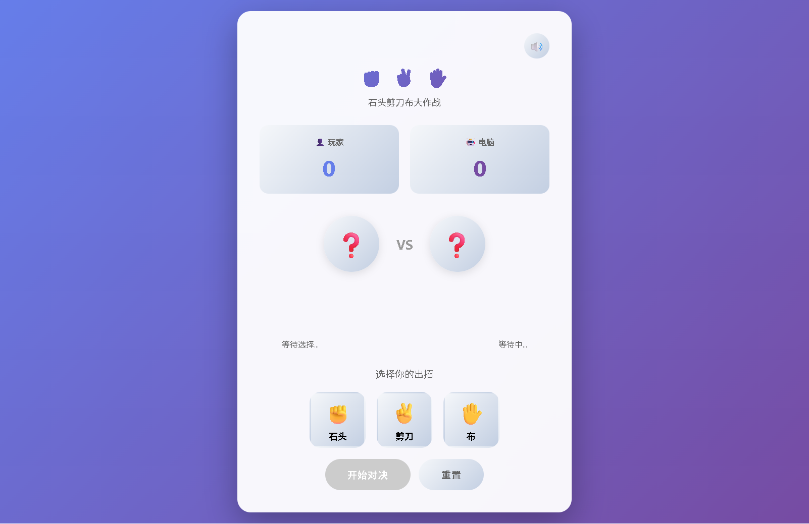

# 🎮 石头剪刀布游戏 / Rock Paper Scissors Game

一个精美的石头剪刀布网页游戏，支持音效、动画效果和计分功能。

A beautiful rock-paper-scissors web game with sound effects, animations, and scoring.

---

## 📸 游戏截图 / Screenshot



---

## ✨ 功能特性 / Features

### 🎨 视觉效果 / Visual
- 紫色渐变背景 + 毛玻璃卡片设计
- 现代化 UI，圆角设计
- 流畅的动画效果（悬停、选中、胜利/失败）
- Emoji 图标增强视觉体验

### 🎵 音效系统 / Sound Effects
- 使用 Web Audio API 生成音效
- 支持音效开关
- 多种音效：选择、开始、思考、胜利、失败、平局

### 🎯 游戏功能 / Gameplay
- 计分板：记录玩家和电脑得分
- 对战展示：实时显示双方选择
- 一键重置：快速开始新游戏
- 响应式设计：支持移动端

---

## 🚀 快速开始 / Quick Start

1. 克隆仓库 / Clone the repository:
```bash
git clone https://github.com/rivalhw/RockPaperScissorsGame.git
```

2. 打开 `RockPaperScissorsGame.html` 文件即可开始游戏！

   Open `RockPaperScissorsGame.html` in your browser to play!

---

## 📁 文件结构 / File Structure

```
RockPaperScissorsGame/
├── RockPaperScissorsGame.html    # 主页面 / Main HTML
├── RockPaperScissorsGame.js      # 游戏逻辑 / Game Logic
├── images/
│   └── gamescreenV1.0.png        # 游戏截图 / Screenshot
└── README.md                     # 说明文档 / Documentation
```

---

## 🛠️ 技术栈 / Tech Stack

- HTML5
- CSS3 (渐变、动画、Flexbox)
- JavaScript (ES6+, Web Audio API)
- 无需外部依赖 / No external dependencies

---

## 📄 许可证 / License

MIT License

---

> 🎉 祝你玩得开心！Have fun playing!
